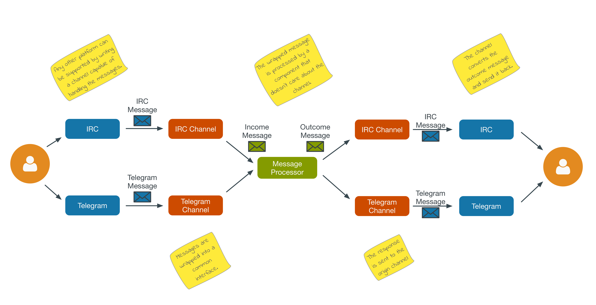

:experimental:
:icons: font
:source-highlighter: pygments
:pygments-style: manni
:pygments-linenums-mode: inline
:last-update-label!:

= Boteco

What if you could write a bot that works on every chat platform? Boteco is a set of abstractions that allows you to write a bot that have the same behaviour across different platforms.

Boteco is gladly built on top of JBoss Fuse.

== How to build

Just do the classical Maven command:

[source,bash]
----
$ mvn install
----

== How to run

It's easier than fall of a bike! From your Fuse console, do the following commands:

[source]
----
features:addurl mvn:tools.devnull/boteco-features/1.0.0/xml/features #<1>

features:install boteco #<2>

osgi:start boteco-channel-irc boteco-chanel-telegram #<3>
----
<1> Use the version you desire to run
<2> Installs all necessary bundles to run Boteco
<3> Starts the built in channels

[NOTE]
====
Built in channels will not start automatically. You need to specify the channels you want (and configure them correctly).

See the channel projects for details about how to configure each one.
====

== Concepts

Boteco consists basically on the following components:

- *Channel*: a channel is responsible for doing the communication between the Bot and the chat platform.
- *IncomeMessage*: represents a content received from a channel.
- *MessageProcessor*: process income messages.

The flow is pretty simple: a content arrives through a channel, is passed to a processor and the response is send back through the same channel. The figure bellow illustrates the flow:

But how messages from different channels can be processed by the same processor? Let's find out!

=== Message Processor

A Message Processor is a class that implements the _MessageProcessor_ interface:

[source,java]
----
public class PingMessageProcessor implements MessageProcessor {

  @Override
  public boolean canProcess(IncomeMessage content) { //<1>
    return check(content).accept(command("ping")); //<2>
  }

  @Override
  public void process(IncomeMessage content) { //<3>
    content.reply("%s: pong", content.sender()); //<4>
  }

}
----
<1> Checks if the processor can process a content
<2> Built in DSL to help you write the check code
<3> Process the given content
<4> Reply to the content without know how to send it

=== Channel

Your Message Processor doesn't need to know how to send a content, but the Channel needs. A Channel is the integration between the chat platform and the Boteco runtime, a *camel route* is the most obvious thought.

A Channel needs to receive a content, wraps it in an instance of `IncomeMessage` and then send to the `MessageProcessor`.

[NOTE]
====
Boteco comes with some channel implementations. Look for the `channels` folder to see how they are implemented and how you can configure them.
====

=== Routing to Message Processor

When you write a channel, you need to pass the income content to be processed (or not). Instead of writing the code to find the Message Processor, you can use a JMS queue to do the work. Boteco comes with a OSGi bundle that uses the OSGi Registry to discover the Message Processors, allowing you to _hot-deploy_ a Message Processor.

To send an income message for processing, just send it to the `boteco.message.process` queue and the Message
Processor Strategy will process it for you.